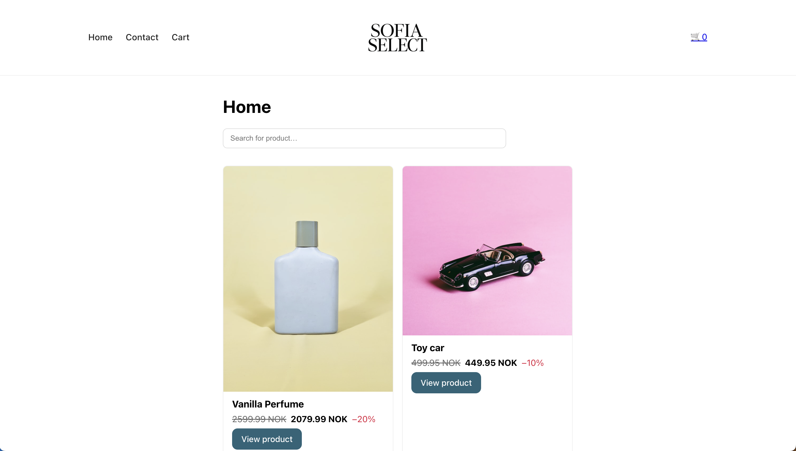

# Sofia Select – React eCommerce Store

Deployed: <https://sofiaselect.netlify.app/>  
GitHub: <https://github.com/KineOnes/noroff-ecom>  
API: https://v2.api.noroff.dev/online-shop

## 🎯 About
Sofia Select is a small eCommerce web app built with React.  
It uses the Noroff Online Shop API to fetch products and display them dynamically.  
Users can browse products, search with a look-ahead search bar, view individual items, add products to a cart, and complete checkout with a success message.

## 🧱 Features
- Homepage with product list and search bar  
- Product page with price, discount, and reviews  
- Add to cart button + cart icon showing number of items  
- Cart page with total sum and remove option  
- Checkout success page that clears the cart  
- Contact page with full validation  
- Responsive layout with header, footer, and layout component  
- Data from Noroff API using fetch  
- React Router for page navigation

## Screenshot



## Project Description

The goal of this project was to build a modern React-based eCommerce application using the Noroff Online Shop API. 

The application demonstrates component structure, routing, state management using Context API, and form validation.


## ⚙️ Technologies
- React (Create React App)
- React Router
- Context API (for cart state)
- CSS Modules / plain CSS
- Deployed on Netlify

## Student Reflection

This project helped me understand API integration, state management using Context API, and how to structure a scalable React application. 

Working with dynamic data and routing improved my understanding of real-world frontend development.


## Installation
```bash
git clone https://github.com/KineOnes/noroff-ecom
cd noroff-ecom
npm install
npm start